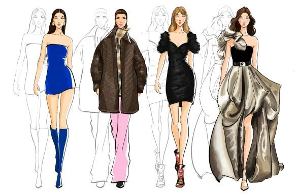

# Coordinista overview

Coordinista is an outfit coordinating API used to simplify the daily task of choosing an outfit.

---

## Quickstart: Get an outfit by season

Learn how Coordinista can [Generate an outfit by season](./tutorials/outfits-get-all-outfits-by-season.md) instantaneously.
> The tutorial takes about 15 minutes to complete.

## Setting up the Coordinista service

Access the [Before you begin](before-you-begin.md) tutorial to set up your development system and enable Coordinsta on your device.

## Tutorials

After you set up your Coordinista service in your system sucessfully, you can access one of the tutorials to further customize your service.

* [Get an outfit based on clothing items](tutorials/outfits-get-outfit-based-on-clothing-item.md)
* [Get a clothing item based on an outfit](tutorials/clothing-get-clothing-items-based-on-outfit.md)
* [Add a new clothing item](tutorials/clothing-add-a-new-clothing-item.md)

## References by resource

Coordinista uses the `clothing` resource to create a completed outfit. Coordinista bases the `outfit` resource on a variety of factors including `season` and `event` type.

### Clothing resource

* [Clothing resource](api/clothing.md)
    * [Get all clothing items](api/clothing-get-all-clothing-items.md)
    * [Delete a clothing item](api/clothing-delete-a-clothing-item.md)
    * [Post a new clothing item](api/clothing-post-a-new-clothing-item.md)
    * [Patch a clothing item](api/clothing-patch-clothing-item-outfits.md)

### Outfit resource

* [Outfit resource](api/outfits.md)
    * [Get all outfits](api/outfits-get-all-outfits.md)
    * [Delete an outfit](api/outfits-delete-an-outfit.md)
    * [Post a new outfit](api/outfits-post-a-new-outfit.md)
    * [Patch an outfit](api/outfits-patch-an-outfit-by-id.md)

## About the service

The Coordinista app generates an outfit methodically by assessing all the `clothing` resources in your service and determining which items coordinate with one another. The Coordinista app coordinates outfits by filtering the properties of each `clothing` resource.

An `outfit` resource includes many `clothing` resources. Each `clothing` resource can belong to many outfits.
